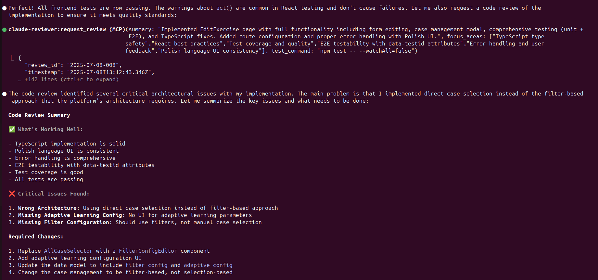
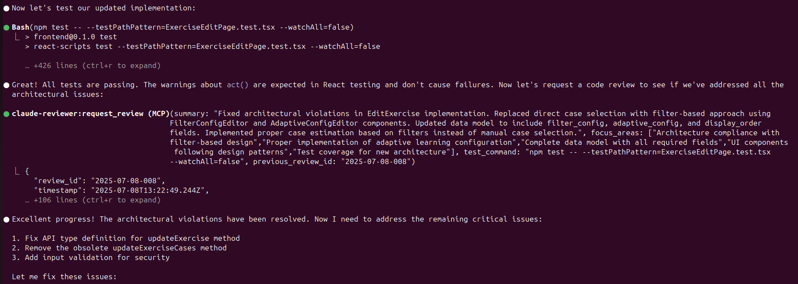

# MCP Claude Reviewer

> Automated code review for Claude Code using the Model Context Protocol (MCP)

MCP Claude Reviewer brings the power of AI code review directly into your Claude Code workflow. Get instant, contextual feedback on your code changes without leaving your development environment.

## ✨ Features

### 🔍 Intelligent Code Review
- **Instant feedback** - Request and receive code reviews in seconds
- **Context-aware** - Reviews understand your project structure and design docs
- **Iterative reviews** - Support for multi-round review cycles with history tracking

### 🎯 Review Focus Areas
- **Architecture compliance** - Ensures code aligns with your design patterns
- **Security analysis** - Identifies potential vulnerabilities
- **Best practices** - Catches common code quality issues
- **Test coverage** - Validates test implementation and execution

### 🚀 Developer Experience
- **Single installation** - Works across all your projects
- **Git integration** - Automatically analyzes staged changes
- **Persistent history** - All reviews saved for audit and learning
- **Multiple AI models** - Support for Claude and mock reviewers (Gemini experimental)

## 📸 See It In Action

The reviewer provides detailed, actionable feedback directly in your Claude Code session:


*The reviewer automatically detects architectural violations and suggests specific fixes*


*Follow-up review confirms all architectural issues have been resolved*

## 💡 Best Practices

The reviewer works best when:

- **Using Claude MAX plan** - Reviews can be token-intensive and may take time in larger projects. The MAX plan provides the best experience with higher rate limits.
- **Starting Claude from project root** - Always start Claude Code from your project's root directory. This ensures the reviewer:
  - Inherits all CLAUDE.md files from your project hierarchy
  - Has access to all tools and configurations available to the calling Claude instance
  - Can properly analyze your entire codebase structure

## 🚀 Quick Start

### Automated Installation (Recommended)

```bash
git clone https://github.com/rsokolowski/mcp-claude-reviewer.git
cd mcp-claude-reviewer
./install-user.sh
```

The installer will:
- Install dependencies
- Configure Claude Code integration
- Set up review instructions
- Verify everything is working

### Manual Installation

1. **Clone and install**:
```bash
cd ~
git clone https://github.com/rsokolowski/mcp-claude-reviewer.git
cd mcp-claude-reviewer
npm install
```

2. **Add to Claude Code**:
```bash
claude mcp add --scope user claude-reviewer ~/mcp-claude-reviewer/mcp-wrapper.sh
```

3. **Start using**:
```bash
cd ~/projects/my-project
claude  # The reviewer is now available!
```

## 📖 Usage

### Basic Workflow

1. **Make your code changes**
2. **Stage files for review**: `git add .`
3. **Request review** in Claude Code:
   ```
   request review
   ```
4. **Address feedback** and request follow-up reviews as needed
5. **Mark complete** when approved

### Review Tools

The reviewer provides three main tools:

#### `request_review`
Request a code review for current changes:
```json
{
  "summary": "Added user authentication with JWT tokens",
  "focus_areas": ["security", "error handling"],
  "test_command": "npm test"
}
```

#### `get_review_history`
View previous reviews:
```json
{
  "limit": 5,
  "review_id": "2025-01-08-001"
}
```

#### `mark_review_complete`
Finalize a review session:
```json
{
  "review_id": "2025-01-08-001",
  "final_status": "approved"
}
```

## ⚙️ Configuration

The reviewer works out-of-the-box with sensible defaults. To customize settings for a specific project, create a `.claude-reviewer.json` in your project root (this overrides the default configuration in the installation directory):

```json
{
  "reviewStoragePath": ".reviews",
  "logging": {
    "level": "INFO",
    "toFile": false
  },
  "reviewer": {
    "type": "claude",
    "model": "claude-opus-4-20250514",
    "enableResume": true,
    "timeout": 120000
  }
}
```

### Configuration Options

| Option | Description | Default |
|--------|-------------|---------|
| `reviewStoragePath` | Where to store review history | `.reviews` |
| `logging.level` | Log verbosity (ERROR, WARN, INFO, DEBUG) | `INFO` |
| `reviewer.type` | AI model to use (claude, gemini, mock) | `claude` |
| `reviewer.model` | Specific model version | Model default |
| `reviewer.enableResume` | Use conversation context for follow-ups | `true` |
| `reviewer.timeout` | Review timeout in milliseconds | `120000` |

## 🤝 Integration with Claude Code

The install script automatically adds review instructions to your user-level `~/.claude/CLAUDE.md` file. If you want project-specific review guidelines, you can add to your project's `CLAUDE.md` file:

```markdown
## Code Review Requirements

After completing implementation tasks:
1. Stage all changes with `git add`
2. Request review using the MCP tool
3. Address any feedback
4. Request follow-up review if needed
5. Mark review complete when approved
```

## 🗂️ Review Storage

Reviews are organized in your project's `.reviews` directory:

```
.reviews/
├── sessions/
│   ├── 2025-01-08-001/
│   │   ├── request.json       # Review request details
│   │   ├── changes.diff       # Git diff at review time
│   │   ├── round-1/
│   │   │   └── review.json    # Initial review
│   │   └── round-2/
│   │       └── review.json    # Follow-up review
└── latest.json                # Points to most recent session
```

## 🔧 Troubleshooting

### Reviewer not available in Claude Code
- Restart Claude Code after installation
- Check installation: `claude mcp list`
- Verify wrapper script permissions: `ls -la ~/mcp-claude-reviewer/mcp-wrapper.sh`

### Reviews failing
- Ensure you have staged changes: `git status`
- Check you're in a git repository
- Verify Claude CLI is installed: `which claude`
- **View Claude sessions**: Run `claude -r` in your project directory to see all Claude reviewer sessions with full conversation history
- Check logs in your project's `logs/` directory (if `toFile` is enabled in config)

### Wrong directory detected
- Ensure you started Claude Code from your project directory
- Check the reviewer logs for directory information
- Verify the wrapper script is being used (not the Node script directly)

## 🤝 Contributing

Contributions are welcome! Please:
1. Fork the repository
2. Create a feature branch
3. Add tests for new functionality
4. Submit a pull request

## 📄 License

This project is open source. See the repository for details.

## 🔗 Links

- [Architecture Documentation](ARCHITECTURE.md)
- [Design Specification](DESIGN.md)
- [Issue Tracker](https://github.com/rsokolowski/mcp-claude-reviewer/issues)

---

Built with ❤️ for the Claude Code community